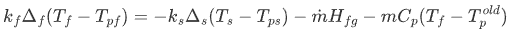
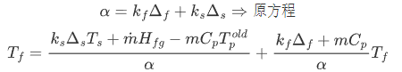

# OFdevelopForLearing
OpenFOAM solver ：针对谷粒干燥（[博客地址](https://s-explorer.github.io/posts/kernelPhaseTrasition4FOAM/)）

- newBC：conjugate heat and mass transfer BC
- MultiFoam 依据chtMultiRegionFoam更改，添加了物料运输相关内容。

### 2022-4-18

修改了newBC中的q计算，直接通过蒸发率公式计算出蒸发量，以此致作为蒸发热值。

修改了mixed边界条件的系数，取消了传质过程的影响单纯考虑传热过程

```c++
//valueFraction() = alpha/(alpha + myKDelta_);
valueFraction() = KDeltaNbr/(KDeltaNbr + myKDelta_);
//refValue() = (KDeltaNbr*nbrIntFld + mpCpdt*TOld + dmHfg) / alpha ;
refValue() = nbrIntFld;
```

### 2022-5-13

添加了2D的米粒模型算例，水含量耦合计算，通过平衡湿度与颗粒的表面的湿度的差值计算水分的表面通量。

在边界条件中的实现：

```c++
//计算相对湿度
scalar Xv = Yi/Mv / (Yi/Mv + ((1 - Yi) / Mcomp_));
scalar RH = min( Xv * pFfluid / Psat, 1.0);
//计算颗粒的平衡湿度
scalar Weq = 1 / 14.93306 * ( log(4315.76/(8.32*(Tinfluid - 81.7849))) - log(-log(RH)));
//计算通量
const scalar Hm = Dsolidtmp * Shnumber(Re,Sc) / L_;
dm[faceI] = rhosolid * Hm * (Yisolidtmp - Weq)
```

### 2022-9-15

考虑了颗粒中的介质蒸发影响因素有如下三种：

-   颗粒中所能释放的介质
-   空气中所能吸收的介质
-   空气饱和状态所能吸收的介质

最终的界面的传质速率取决去其中最小的一个量。

对于边界上的更新：



转换为 `mixed`形式可以得到：



### 2023-11-5

添加`CMakeLists`，适配版本为`OF2212`。

```bash
# 先启动OF环境
mkdir build; cd build
cmake ..
make -j{parallel threads}
# 仅编译求解器 make target
make kernelPhaseTransitionFOAM 
```

添加算例配置文件中谷粒三层结构的相关参数读取，在`constant/solid/SolidProperties`文件内：

```
hull_a	4.84e2
hull_b	7380.8
bran_a	7.97e-1
bran_b	5110.0
endo_a	2.57e-3
endo_b	2880.0
```


