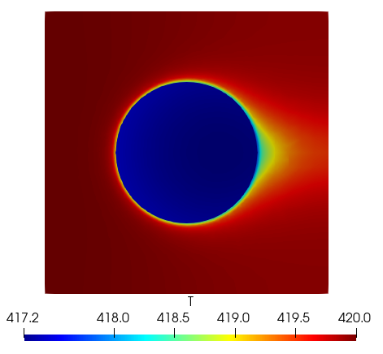

# OFdevelopForLearing
this is OF file for my studies!

- MixedBCforDry 包含了颗粒的传质传热过程的泛化的一种边界条件，其假设水分在组分间的传递全部发生相变。
- MultiFoam 依据chtMultiRegionFoam更改，添加了物料运输相关内容。

### 2022-4-18

修改了newBC中的q计算，直接通过蒸发率公式计算出蒸发量，以此致作为蒸发热值。

修改了mixed边界条件的系数，取消了传质过程的影响单纯考虑传热过程

```c++
//valueFraction() = alpha/(alpha + myKDelta_);
valueFraction() = KDeltaNbr/(KDeltaNbr + myKDelta_);
//refValue() = (KDeltaNbr*nbrIntFld + mpCpdt*TOld + dmHfg) / alpha ;
refValue() = nbrIntFld;
```

更正了case算例，目前testcase为单球形颗粒的传质传热，颗粒努塞尔数 > 200，选择的湍流模型为k-ε双方程模型。

