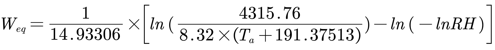

# OFdevelopForLearing
this is OF file for my studies!

- MixedBCforDry 包含了颗粒的传质传热过程的泛化的一种边界条件，其假设水分在组分间的传递全部发生相变。
- MultiFoam 依据chtMultiRegionFoam更改，添加了物料运输相关内容。

### 2022-4-18

修改了newBC中的q计算，直接通过蒸发率公式计算出蒸发量，以此致作为蒸发热值。

修改了mixed边界条件的系数，取消了传质过程的影响单纯考虑传热过程

```c++
//valueFraction() = alpha/(alpha + myKDelta_);
valueFraction() = KDeltaNbr/(KDeltaNbr + myKDelta_);
//refValue() = (KDeltaNbr*nbrIntFld + mpCpdt*TOld + dmHfg) / alpha ;
refValue() = nbrIntFld;
```

更正了case算例，目前testcase为单球形颗粒的传质传热，颗粒努塞尔数 > 200，选择的湍流模型为k-ε双方程模型。


### 2022-5-13

添加了2D的米粒模型算例，水含量耦合计算，通过平衡湿度与颗粒的表面的湿度的差值计算水分的表面通量。

计算公式如下：



在边界条件中的实现：

```c++
//计算相对湿度
scalar Xv = Yi/Mv / (Yi/Mv + ((1 - Yi) / Mcomp_));
scalar RH = min( Xv * pFfluid / Psat, 1.0);
//计算颗粒的平衡湿度
scalar Weq = 1 / 14.93306 * ( log(4315.76/(8.32*(Tinfluid - 81.7849))) - log(-log(RH)));
//计算通量
const scalar Hm = Dsolidtmp * Shnumber(Re,Sc) / L_;
dm[faceI] = rhosolid * Hm * (Yisolidtmp - Weq)
```

