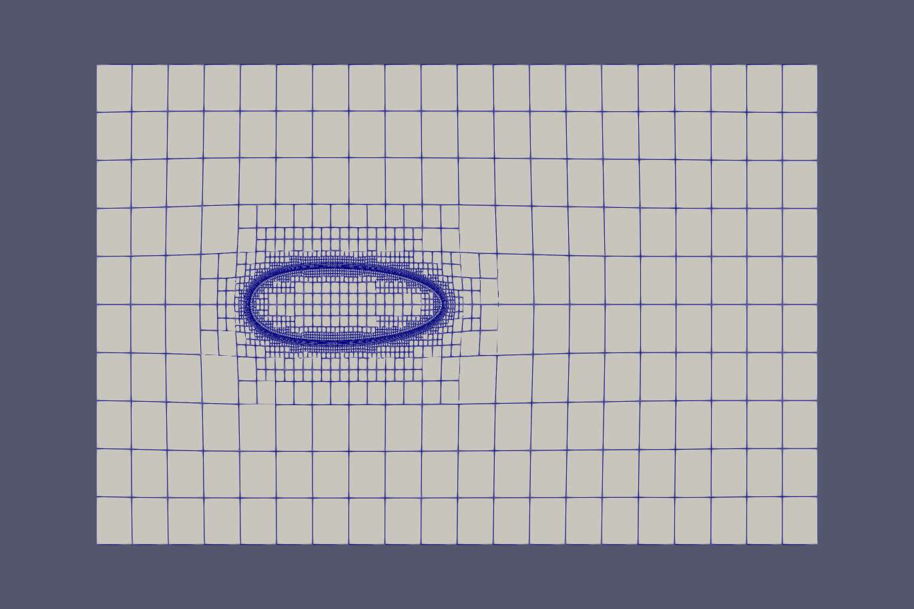
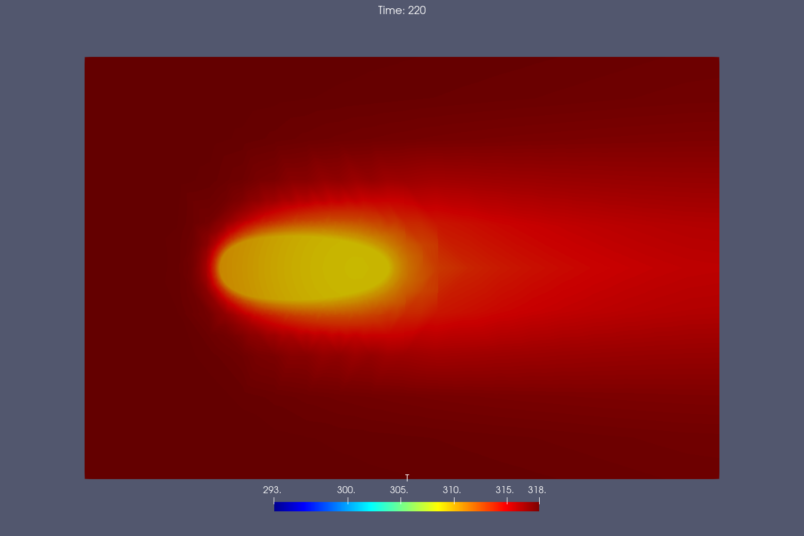

# 米粒的2D模型

本例是根据米粒的三维模型的二维简化，通过snappyHexMesh和extrudeMesh生成二维网格。

IC设置 

|      变量名      |  数值  |
| :--------------: | :----: |
|   入口空气速度   | 0.1m/s |
|   入口空气温度   |  318k  |
| 入口空气相对湿度 |  13%   |
| 颗粒水分扩散系数 |  1e-9  |
|  颗粒的初始温度  |  293k  |
|   环境初始温度   |  293k  |

### 温度

颗粒与外界流体在220s时刻的温度分布。

### 含水量

颗粒与外界流体在1000s时刻的含水量分布。

