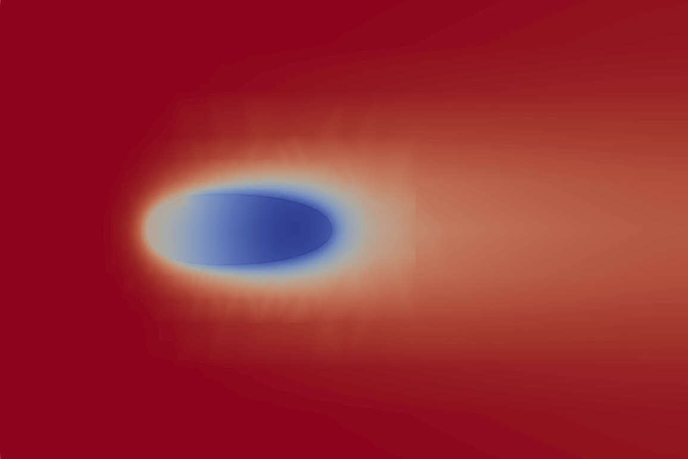

## 更新边界

整理传热性质公式可得到如下的等式：
$$
k_f\Delta_f(T_f - T_{pf}) = -k_s\Delta_s(T_s-T_{ps})-\dot{m}H_{fg}-mC_p(T_f-T_p^{old})
$$
将界面温度相等的关系带入可得：
$$
\begin{gather*}
(k_f\Delta_f+k_s\Delta_s)T_p = (k_f\Delta_f + mC_p)T_f+k_s\Delta_sT_s+\dot{m}H_{fg}-mC_pT_p^{old}\newline
\Downarrow\\
T_p = \frac{k_s\Delta_s}{k_f\Delta_f+k_s\Delta_s}T_s + \frac{k_f\Delta_f + mC_p}{k_f\Delta_f+k_s\Delta_s}T_f+\frac{\dot{m}H_{fg}-mC_pT_p^{old}}{k_f\Delta_f+k_s\Delta_s}
\end{gather*}
$$
在OpenFOAM中couple边界一般遵循着mixed处理办法，将所得式子转化为mixed的样式：
$$
\phi _f=\omega \phi _{ref}+(1-\omega )(\phi _c+\Delta \nabla \phi _{ref})
$$
那么对于上面的式子可以有：
$$
\begin{align}
\phi_f &= T_p\\
\phi_c &= T_f\\
1-\omega &= \frac{k_f\Delta_f + mC_p}{k_f\Delta_f+k_s\Delta_s}\\
\omega &= \frac{k_s\Delta_s - mC_p}{k_f\Delta_f+k_s\Delta_s}\\
\phi_{ref} &= \frac{\frac{k_s\Delta_s}{k_f\Delta_f+k_s\Delta_s}T_s+\frac{\dot{m}H_{fg}-mC_pT_p^{old}}{k_f\Delta_f+k_s\Delta_s}}{\frac{k_s\Delta_s - mC_p}{k_f\Delta_f+k_s\Delta_s}}
\end{align}
$$
令：
$$
\alpha = k_f\Delta_f + k_s\Delta_s \Rightarrow原方程\\
T_f = \frac{k_s\Delta_sT_s+\dot{m}H_{fg}-mC_pT_p^{old}}{\alpha}+\frac{k_f\Delta_f+mC_p}{\alpha}T_f
$$

## 计算

计算结果如下：

温度场

湿度场

.png)

湿度梯度